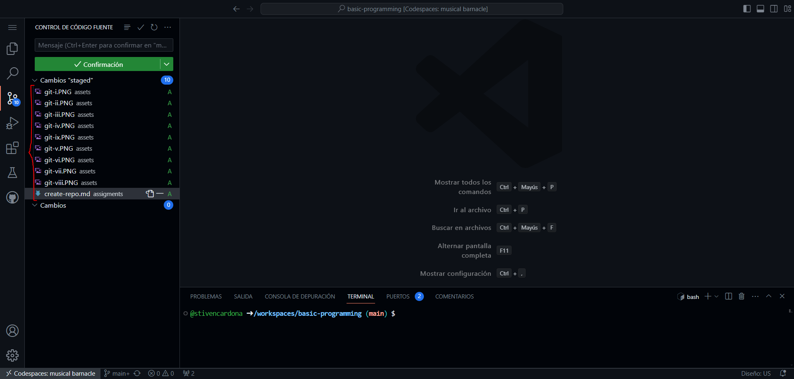

# CREACION DE NUESTRO PRIMER REPOSITORIO

## REQUISITOS

1. Ingresar a [github](www.github.com) y crear una nueva cuenta.

## INTRUCCIONES

### CREAR NUESTRO PRIMER REPOSITORIO

1. Una vez tengamos creada nuestra cuenta en github nos vamos a crear un nuevo repositorio dando click en nuevo repositorio como se muestra en la imagen a continuacion

    

2. Una vez le dimos click en el boton anterior se nos carga la siguiente vista:

    

3. Ahora llenamos los datos del fomulario asignandole un nombre a nuestro repositorio poniendo una description y dejando confirmada la casilla de agregar un `README file` o `Agregar un archivo LEAME` en caso de tenerlo en espanol como se muestra a continuacion:

    

4. Ahora damos click en crear el repositorio

    

Y listo con estos pasos hemos creado nuestro primer repositorio :3 , deberia verse de manera similar a esta imagen:

## INCIAR UN ESPACIO DE TRABAJO

1. Estando en nuestro repositorio, como el que acabamos de crear, oprimimos las teclas `ctrl` + `alt` + `,` y con esto inciaremos un nuevo espacio de tabajo similar a como se muestra a continuacion:

    

2. Como podemos notar es un `VS Code` en la nube que incluso tiene una terminal incluida, con python y muchos otros lenguajes de programacion

## GUARDAR ARCHIVOS EN NUESTRO REPOSITORIO USANDO EL ESPACIO DE TRABAJO

1. Estando en nuestro espacio de trabajo podremos crear archivos y ejecutarlos, una vez queramos guardarlos en el repositorio damos click en el icono de las ramas:

    

2. Esto nos abrira una nueva vista en el panel de la derecha similar a esta, pero con los cambios que nosotros hayamos agregado

    

3. Estando en esta vista agregamos dando click en `+` en los archivos que queramos guardar, y la vista quedara asi:

    

4. Agregamos un mensaje asociado a este nuevo cambio que vamos a guardar y confirmamos dando click en el boton `commit` o `confirmacion` si lo tenemos en espanol:

    

    

5. Ahora como ultimo paso sincronizamos nuestros cambios y ya deberia aparecer todo nuestro codigo en el repositorio.

    